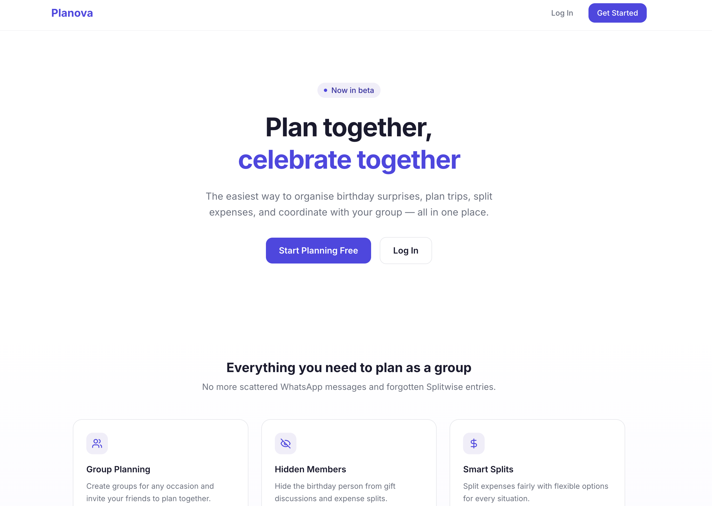
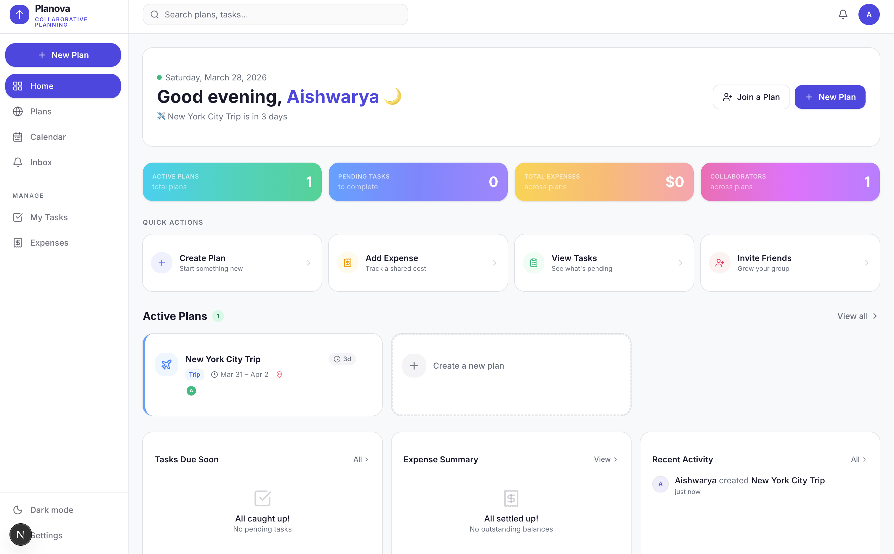
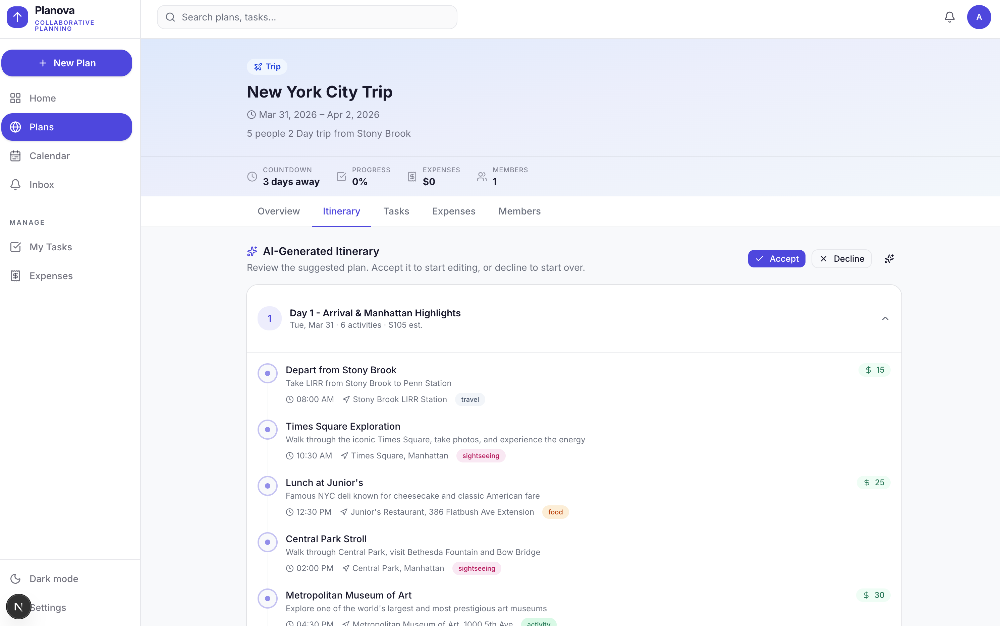
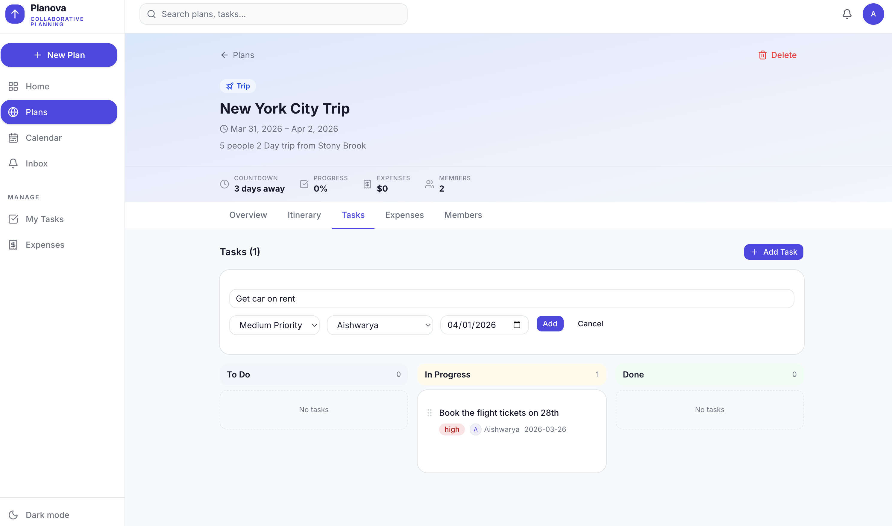
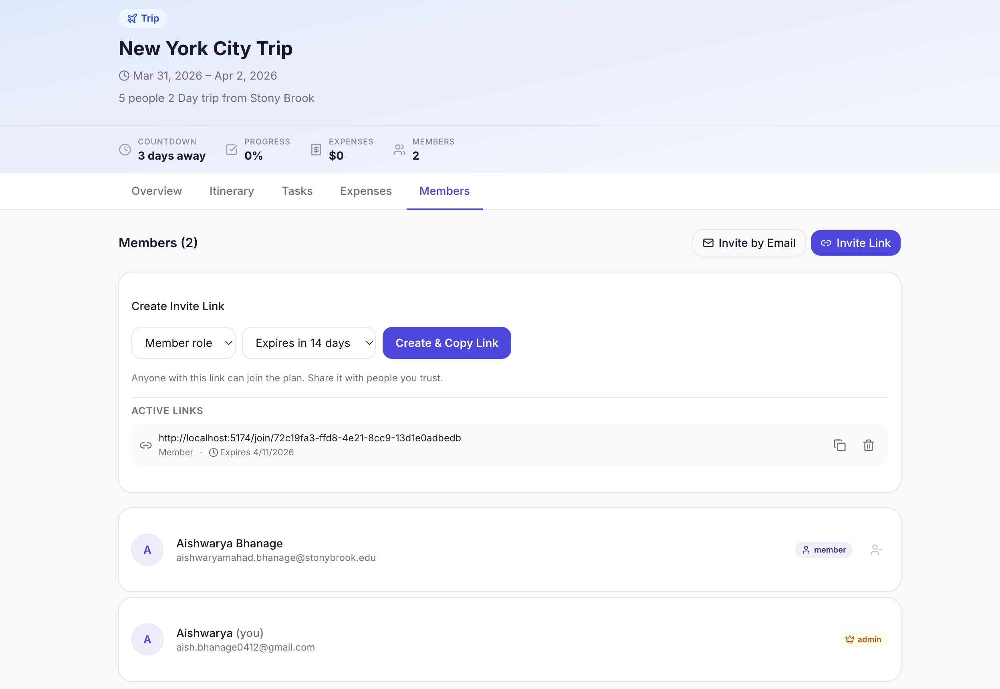
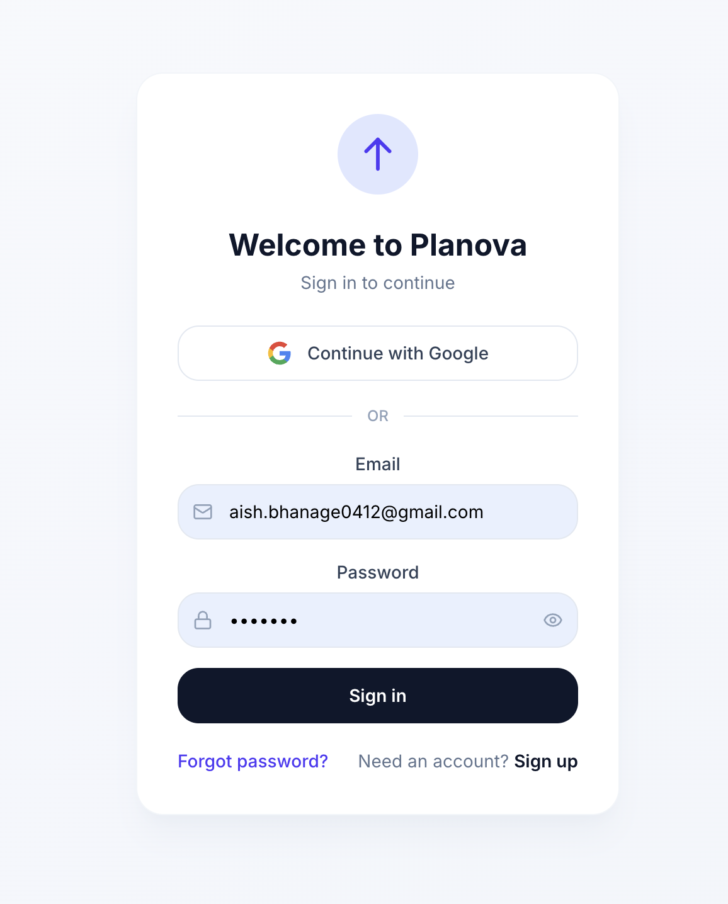
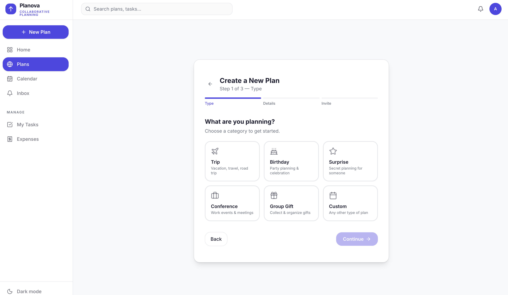
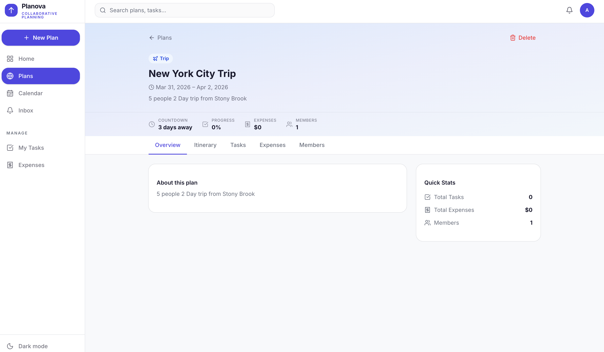

# Planova- Plan Together, Celebrate Together

A collaborative group planning app that makes it easy to organise trips, birthday surprises, events, and more — all in one place. No more scattered WhatsApp messages and forgotten Splitwise entries.



## Features

### Group Planning with Roles
Create plans for any occasion — trips, birthdays, events, conferences, or custom — and invite friends via shareable links. Each member gets a role (admin, member, or viewer) for fine-grained access control.



### AI-Powered Itineraries
Generate day-by-day itineraries using AI (powered by Claude). Review the AI-generated draft, accept or decline it, then customise individual days, activities, time slots, locations, and estimated costs.



### Task Management
Create and assign tasks within plans. Set priorities (low, medium, high), track status (todo, in progress, done), and set due dates so nothing falls through the cracks.



### Invite Links & Collaboration
Generate invite links with optional expiration and role assignment. Anyone with the link can preview the plan and join with one click.



### Activity Tracking
Full audit log of who did what — every action is recorded so the group stays in sync.

### Expense Splitting *(coming soon)*
Split expenses fairly with flexible options for every situation.

## Tech Stack

| Layer | Technology |
|-------|-----------|
| **Frontend** | Next.js 16, React 19, TypeScript, Tailwind CSS 4, Zustand |
| **Backend** | Node.js, Express 5, Sequelize ORM |
| **Database** | PostgreSQL |
| **AI** | Anthropic Claude API |
| **Auth** | JWT (access + refresh tokens), bcrypt |
| **UI** | shadcn/ui, Lucide Icons, Sonner (toasts) |

## Project Structure

```
Planova_PlanTogether/
├── frontend/               # Next.js 16 + React 19 + TypeScript
│   ├── src/
│   │   ├── app/
│   │   │   ├── (app)/      # Protected routes (dashboard, plans, tasks...)
│   │   │   ├── (auth)/     # Auth routes (login, register)
│   │   │   └── join/       # Invite link acceptance
│   │   ├── components/     # UI & feature components
│   │   ├── services/       # API client (Axios)
│   │   └── stores/         # Zustand state management
│   └── ...
├── backend/                # Express 5 REST API
│   ├── src/
│   │   ├── config/         # DB & environment config
│   │   ├── controllers/    # Route handlers
│   │   ├── middleware/      # Auth & error handling
│   │   ├── models/         # Sequelize models
│   │   └── routes/         # API route definitions
│   └── ...
└── API_CONTRACT.md         # API documentation
```

## Getting Started

### Prerequisites

- **Node.js** (v18 or higher)
- **PostgreSQL** (running locally or remote)
- **Anthropic API Key** (for AI itinerary generation)

### 1. Clone the repository

```bash
git clone https://github.com/AishwaryaBhanage/Planova_PlanTogether.git
cd Planova_PlanTogether
```

### 2. Set up the backend

```bash
cd backend
npm install
```

Create a `.env` file in the `backend/` directory:

```env
# Server
PORT=5001
NODE_ENV=development

# Database (PostgreSQL)
DB_HOST=localhost
DB_PORT=5432
DB_NAME=planova
DB_USER=postgres
DB_PASSWORD=your_password_here

# JWT
JWT_SECRET=your_jwt_secret_here
JWT_EXPIRES_IN=1h
JWT_REFRESH_SECRET=your_refresh_secret_here
JWT_REFRESH_EXPIRES_IN=7d

# Anthropic AI
ANTHROPIC_API_KEY=your_anthropic_api_key

# Frontend URL (CORS)
FRONTEND_URL=http://localhost:3000
```

Start the backend:

```bash
npm run dev
```

> The database tables are auto-created on startup via Sequelize sync.

### 3. Set up the frontend

```bash
cd frontend
npm install
npm run dev
```

The app will be available at **http://localhost:3000**.

## API Highlights

| Endpoint | Description |
|----------|-------------|
| `POST /api/auth/register` | Register a new user |
| `POST /api/auth/login` | Login and receive JWT tokens |
| `POST /api/plans` | Create a new plan |
| `POST /api/plans/:id/itinerary/generate` | Generate AI itinerary |
| `POST /api/plans/:id/itinerary/accept` | Accept AI-generated draft |
| `GET /api/plans/:id/tasks` | List tasks for a plan |
| `POST /api/plans/:id/invite-links` | Create a shareable invite link |
| `POST /invite/:token/accept` | Join a plan via invite link |

See [API_CONTRACT.md](API_CONTRACT.md) for the full API documentation.

## Screenshots

<details>
<summary>Click to view all screenshots</summary>

| Feature | Screenshot |
|---------|-----------|
| Landing Page |  |
| Auth |  |
| Dashboard |  |
| Create Plan |  |
| Plan Detail |  |
| AI Itinerary |  |
| Tasks |  |
| Members |  |

</details>

## Contributing

1. Fork the repository
2. Create your feature branch (`git checkout -b feature/amazing-feature`)
3. Commit your changes (`git commit -m 'Add amazing feature'`)
4. Push to the branch (`git push origin feature/amazing-feature`)
5. Open a Pull Request

## License

This project is open source and available under the [MIT License](LICENSE).

---

Built with care by [Aishwarya Bhanage](https://github.com/AishwaryaBhanage)
